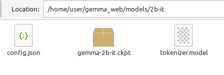

# Run Gemma LLM on a local computer (Python/PyTorch)
  
<sub>*Copyright 2024, PT Miller > For Academic Use  
*Gemma folder Copyright 2024 Google distributed under Apache License, V2</sub> 

<sub>Licensed under the Apache License, Version 2.0 (the "License");
you may not use this file except in compliance with the License.
You may obtain a copy of the License at*</sub>

<sub>**http://www.apache.org/licenses/LICENSE-2.0**</sub>

<sub>*Unless required by applicable law or agreed to in writing, software
distributed under the License is distributed on an "AS IS" BASIS,
WITHOUT WARRANTIES OR CONDITIONS OF ANY KIND, either express or implied.
See the License for the specific language governing permissions and
limitations under the License.*</sub>
  
***
# Get started
## Install the latest NVIDIA system driver https://www.nvidia.com/download/index.aspx
#### If you wish to add cuda and cudnn to your system:
##### https://developer.nvidia.com/cuda-downloads
##### https://developer.nvidia.com/cudnn-downloads

## Python Install
#### https://www.python.org/downloads/  
  
## Install torch with cuda support (https://pytorch.org/get-started/locally/)
For Windows: 
   ```bash
   pip3 install torch torchvision torchaudio --index-url https://download.pytorch.org/whl/cu121
   pip3 install immutabledict sentencepiece Flask
   ```
  
For Linux: 
   ```bash
   pip3 install torch torchvision torchaudio immutabledict sentencepiece Flask
   ```
  
Or install using Conda with: 
   ```bash
   conda install pytorch torchvision torchaudio pytorch-cuda=12.1 -c pytorch -c nvidia
   pip3 install immutabledict sentencepiece Flask
   ```
  
*** 
## Add the large language model to the project
+ Version options are '2b', '2b-it', '7b', 7b-it'. The 'it' in name indicates an instruction-tuned model.   
+ Download the desired model from https://www.kaggle.com/models/google/gemma/frameworks/pyTorch.
  
  
  
+ <b>Recommend starting with 2b-it<b>. (Worked on a simple laptop with RTX2060 6GB VRAM).  
+ Extract contents from the downloaded archive.tar.gz and put the files under the 'model/\<version\>/' folder.  
  https://pureinfotech.com/extract-tar-gz-files-windows-11/

  In Jupyter they look something like:  
    

  In a file viewer they look something like:  
    
  
***
## Methods to run
Code is provided to test gemma models on a local computer. Three methods are provided:

+ Web browser - Enter the following and open the resulting IP in a browser:
   ```bash
   python3 web.py
   ```
+ Command line - Enter the following and respond to prompts:
   ```bash
   python3 main.py
   ```
+ Jupyter Notebook - In Jupyter, open pytorch_gemma.ipynb. https://www.anaconda.com/download/
  
   
*** 
## Modify the parameters in the code as desired
+ The output_len indicates the max allowed for model output. 
+ Machine - use 'cuda' if you have cuda installed with an Nvidia GPU, otherwise use 'cpu'.
+ Use of 'cpu' is not recommended and will be slow. Drop output_len down to 65 or so if using 'cpu'.
+ Example code to change in main.py -> model = GemmaModel(output_len=250, version='2b-it', machine='cuda')
  
***
## Recommended
The code in this repository was tested with python 3.10 & 3.12, with Nvidia driver version 550.54.14.

## Disclaimer
+ This is not a Google product. This project serves as an interface to Google's Gemma LLM.  
+ You must agree to Google's terms of service to utilize Gemma.  
+ Terms https://www.kaggle.com/models/google/gemma/license/consent  
  
  

